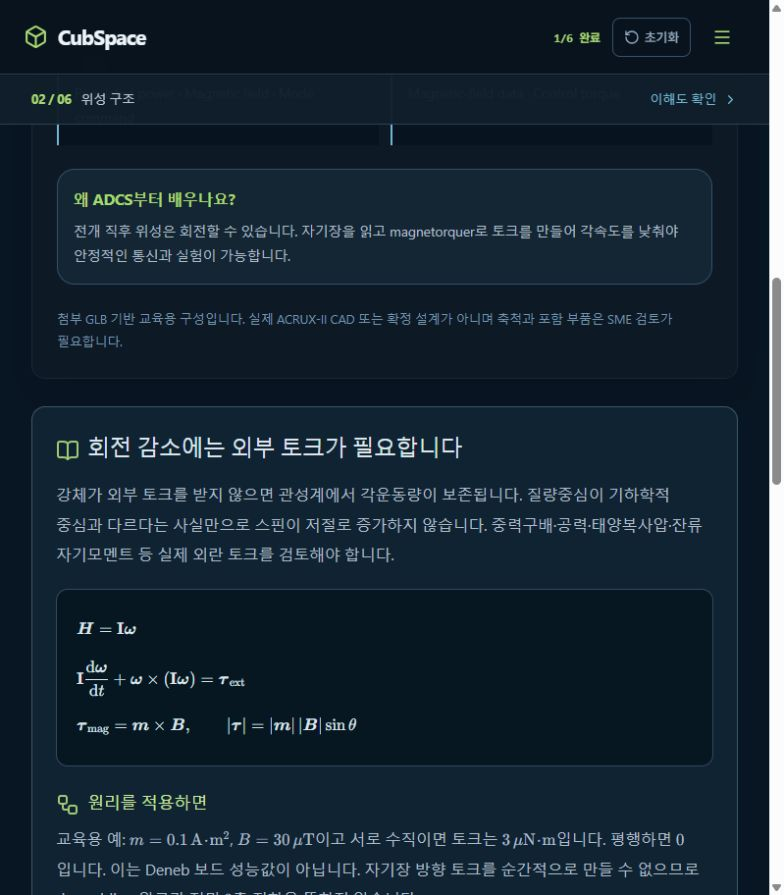

# [VariableVisual] 유도보다 변수 의미와 그림을 우선 표시

## A. Task Details
- **No.** CUB-012 | **Epic** VariableVisual | **Assignee** TBD (Draft)
- **Sign-off?** Red (todo)
- **Description:** 유도보다 변수 의미와 그림을 우선 표시
- **Target:** cubspace-branch/onboarding_training · **URL:** http://localhost:3000/#anatomy

## B. Relation
Hierarchy (제안): cubspace → onboarding → variable_visuals → Cell → CUB-012
```prolog
% 제안 경로 / 승인된 Tree 원본·버전 TBD
mission_path('CUB-012', [cubspace, onboarding, variable_visuals]).
task_cell('CUB-012', 'variable_visuals_cell').
cell_leaf('variable_visuals_cell', variable_visuals).
sign_off('CUB-012', red).
```

## C. Problem Identification
- **Problem:** 수식 중심 설명에 각 변수의 물리적 의미와 방향을 연결하는 그림이 부족하다.
- **Guideline:** 기존 CUB-001 확장. R01·R02를 참고하고 유도는 선택 설명으로 보존한다.
- **Reproduce Workflow:** ADCS 설명 진입 → 수식 확인 → 변수·방향·단위 설명 비교



## D. Desire Outcome
- **AC-1:** B·m·τ·ω를 같은 좌표계의 벡터 그림과 연결하고 명칭·단위·역할을 표시한다.
- **AC-2:** 기본 화면은 목적·변수·결과를 중심으로 하고 긴 유도는 접을 수 있다.
- **AC-3:** 그림과 대체 설명에서 자기장 방향 토크 제한·가정을 유지하고 모바일에서도 읽힌다.

## E. Action Note for AI
- 기준 확인·수정·검증 후 후보/URL/결과 제공 → Yellow에서 Human Inspection 대기. 지정 승인자의 실제 Sign-off 후 Green → 승인된 Update & Publish·운영 확인 후 Done. 범위 밖 변경 금지. 상세: INDEX.md.
