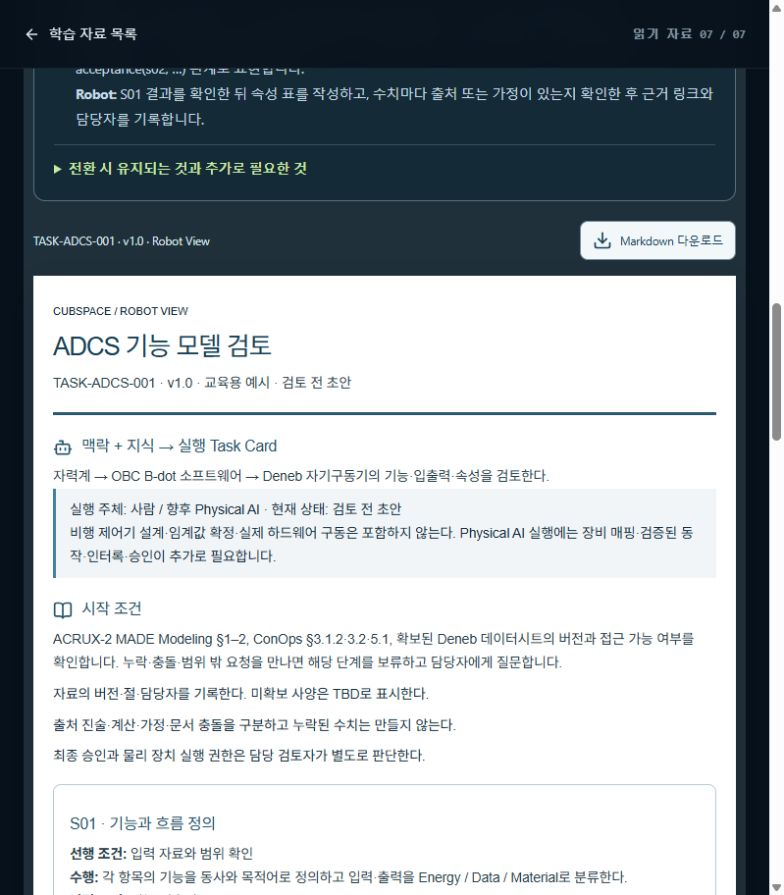

# [LearningGoal] 프로젝트 관리보다 임무·학습 목표를 확장

## A. Task Details
- **No.** CUB-013 | **Epic** LearningGoal | **Assignee** TBD (Draft)
- **Sign-off?** Red (todo)
- **Description:** 프로젝트 관리보다 임무·학습 목표를 확장
- **Target:** cubspace-branch/onboarding_training · **URL:** http://localhost:3000/learn/07

## B. Relation
Hierarchy (제안): cubspace → onboarding → objective_curriculum → Cell → CUB-013
```prolog
% 제안 경로 / 승인된 Tree 원본·버전 TBD
mission_path('CUB-013', [cubspace, onboarding, objective_curriculum]).
task_cell('CUB-013', 'objective_curriculum_cell').
cell_leaf('objective_curriculum_cell', objective_curriculum).
sign_off('CUB-013', red).
```

## C. Problem Identification
- **Problem:** 피드백은 관리 절차보다 실제 공학 목표와 무엇을 판단할 수 있는지에 더 많은 설명을 요구한다.
- **Guideline:** 관리 기능 삭제가 아닌 학습 우선순위 개편. 기존 Sign-off 경계는 유지한다.
- **Reproduce Workflow:** 온보딩 주요 섹션 읽기 → 목표와 관리 설명 비교 → 측정 가능한 학습 결과 확인



## D. Desire Outcome
- **AC-1:** 각 섹션 첫 부분에 학습 후 설명·계산·판단할 수 있는 목표를 1–3개 제시한다.
- **AC-2:** 목표→입력→판단→출력→한계 사례를 연결하고 관리 설명은 인계 단계에 압축한다.
- **AC-3:** 퀴즈/실습을 학습 목표와 대응시키고 학습 완료를 설계 승인으로 표현하지 않는다.

## E. Action Note for AI
- 기준 확인·수정·검증 후 후보/URL/결과 제공 → Yellow에서 Human Inspection 대기. 지정 승인자의 실제 Sign-off 후 Green → 승인된 Update & Publish·운영 확인 후 Done. 범위 밖 변경 금지. 상세: INDEX.md.
