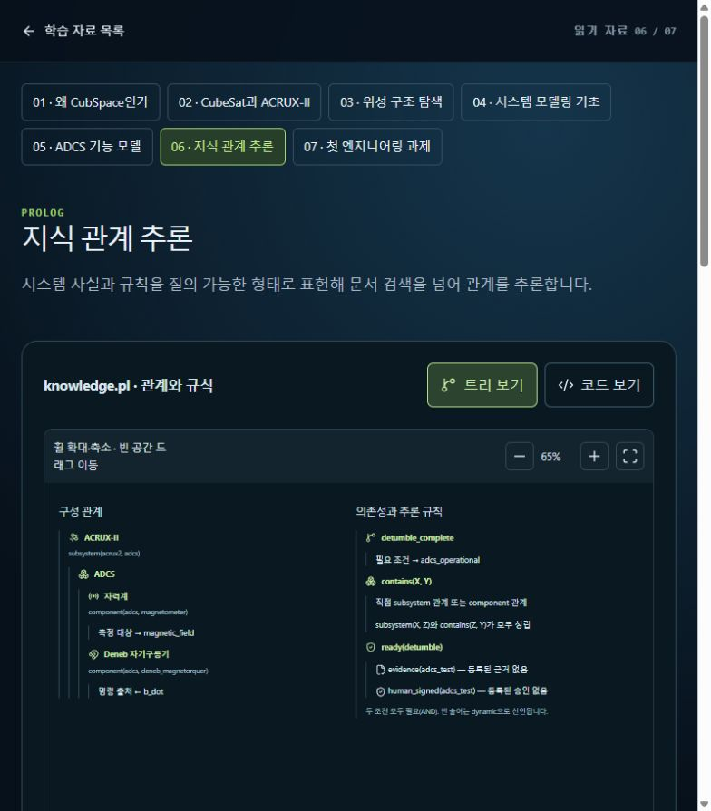

# [PrologControl] Prolog를 입력 검증·실행 근거 추적에 연결

## A. Task Details
- **No.** CUB-018 | **Epic** PrologControl | **Assignee** TBD (Draft)
- **Sign-off?** Red (todo)
- **Description:** Prolog를 입력 검증·실행 근거 추적에 연결
- **Target:** cubspace-branch/onboarding_training · **URL:** http://localhost:3000/learn/06

## B. Relation
Hierarchy (제안): cubspace → onboarding → prolog_sim_gate → Cell → CUB-018
```prolog
% 제안 경로 / 승인된 Tree 원본·버전 TBD
mission_path('CUB-018', [cubspace, onboarding, prolog_sim_gate]).
task_cell('CUB-018', 'prolog_sim_gate_cell').
cell_leaf('prolog_sim_gate_cell', prolog_sim_gate).
sign_off('CUB-018', red).
```

## C. Problem Identification
- **Problem:** 현재 교육용 관계 예시에는 시뮬레이션 schema·run ID·결과와 사람 승인 연결 계약이 없다.
- **Guideline:** R04·CUB-016/017 연계. Prolog는 수치 적분기나 자동 사람 승인자가 아니다.
- **Reproduce Workflow:** Prolog 예시 확인 → 입력/실행/결과 관계 비교 → 누락된 계약 식별



## D. Desire Outcome
- **AC-1:** 입력 유효성·run ID·코드/환경 버전·결과 위치를 facts와 규칙으로 표현한다.
- **AC-2:** Janus/Python 또는 명시적 프로세스 인터페이스를 선택하고 오류·미완료를 보존한다.
- **AC-3:** 시뮬레이션 성공과 human sign-off/게시 승인을 분리하고 실패·미승인 사례로 검증한다.

## E. Action Note for AI
- 기준 확인·수정·검증 후 후보/URL/결과 제공 → Yellow에서 Human Inspection 대기. 지정 승인자의 실제 Sign-off 후 Green → 승인된 Update & Publish·운영 확인 후 Done. 범위 밖 변경 금지. 상세: INDEX.md.
