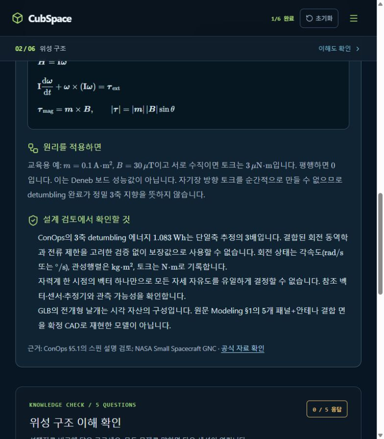

# [Reproducibility] 논문·코드 버전과 수치 검증 기준선 고정

## A. Task Details
- **No.** CUB-019 | **Epic** Reproducibility | **Assignee** TBD (Draft)
- **Sign-off?** Red (todo)
- **Description:** 논문·코드 버전과 수치 검증 기준선 고정
- **Target:** cubspace-branch/onboarding_training · **URL:** http://localhost:3000/#anatomy

## B. Relation
Hierarchy (제안): cubspace → onboarding → sim_baseline → Cell → CUB-019
```prolog
% 제안 경로 / 승인된 Tree 원본·버전 TBD
mission_path('CUB-019', [cubspace, onboarding, sim_baseline]).
task_cell('CUB-019', 'sim_baseline_cell').
cell_leaf('sim_baseline_cell', sim_baseline).
sign_off('CUB-019', red).
```

## C. Problem Identification
- **Problem:** 논문용 weighted main_old와 현재 main이 다르고 활성 외란·적분 오차를 확인하지 않으면 결과를 잘못 해석할 수 있다.
- **Guideline:** R03·R04. 시뮬레이션 재현 결과를 ACRUX-II 비행 검증으로 승격하지 않는다.
- **Reproduce Workflow:** 논문 조건 확인 → main/main_old 분기 비교 → solver·외란·출력 정의 점검



## D. Desire Outcome
- **AC-1:** commit·제어법·seed·초기 상태·궤도·horizon·solver·외란·캐시 조건을 실행 manifest로 고정한다.
- **AC-2:** 무토크 보존량·step 수렴·좌표/단위 변환을 확인하고 허용오차를 사전 정의한다.
- **AC-3:** 직접 실행과 wrapper 비교·실패/미수렴을 기록하고 시간/구동 on-time과 에너지 지표를 구분한다.

## E. Action Note for AI
- 기준 확인·수정·검증 후 후보/URL/결과 제공 → Yellow에서 Human Inspection 대기. 지정 승인자의 실제 Sign-off 후 Green → 승인된 Update & Publish·운영 확인 후 Done. 범위 밖 변경 금지. 상세: INDEX.md.
