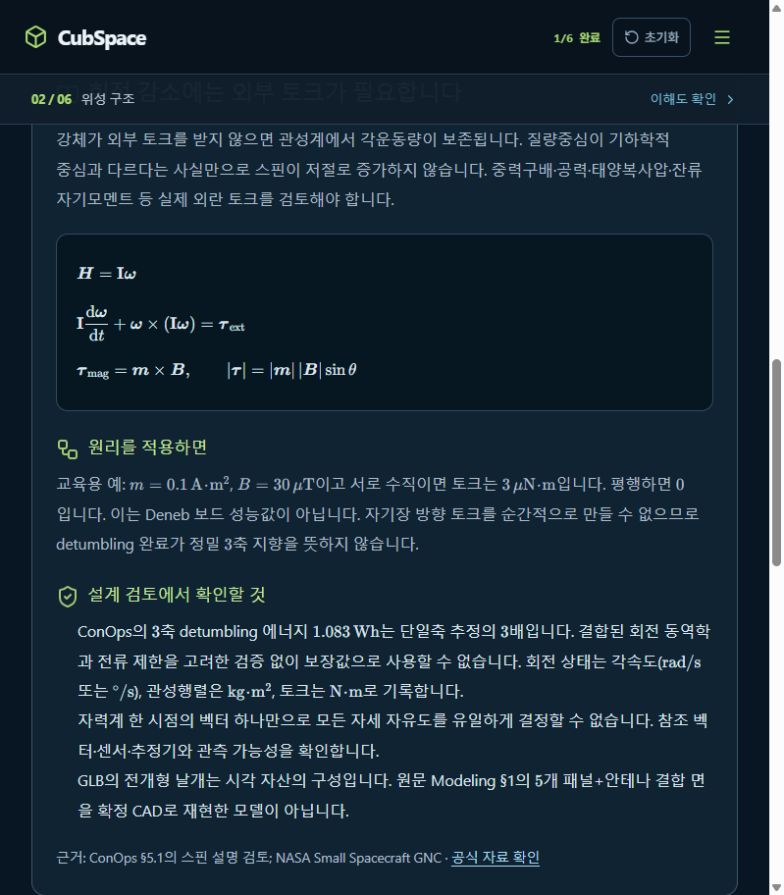

# [WorkedExample] Worked Example을 소제목 토글로 제공

## A. Task Details
- **No.** CUB-002 | **Epic** WorkedExample | **Assignee** TBD (Draft)
- **Sign-off?** Red (todo)
- **Description:** Worked Example을 소제목 토글로 제공
- **Target:** cubspace-branch/onboarding_training · **URL:** http://localhost:3000/#anatomy

## B. Relation
Hierarchy (제안): cubspace → onboarding → worked_example → Cell → CUB-002
```prolog
% 제안 경로 / 승인된 Tree 원본·버전 TBD
mission_path('CUB-002', [cubspace, onboarding, worked_example]).
task_cell('CUB-002', 'worked_example_cell').
cell_leaf('worked_example_cell', worked_example).
sign_off('CUB-002', red).
```

## C. Problem Identification
- **Problem:** 원리를 적용하면 내용이 항상 펼쳐진 본문이어서 기본 설명과 계산 예시를 단계적으로 읽기 어렵다.
- **Guideline:** 교육 가정과 실제 Deneb 성능값의 차이를 숨기거나 삭제하지 않는다.
- **Reproduce Workflow:** ADCS 설명 진입 → 원리를 적용하면 확인 → 접기·펼치기 조작 부재 확인



## D. Desire Outcome
- **AC-1:** Worked Example 소제목을 선택하면 설명을 펼치고 다시 접을 수 있다.
- **AC-2:** 입력값 → 계산 → 결과 → 적용 한계 순서로 예시를 제공한다.
- **AC-3:** 키보드 조작과 펼침 상태 안내를 지원하며 토글로 학습 상태가 초기화되지 않는다.

## E. Action Note for AI
- 기준 확인·수정·검증 후 후보/URL/결과 제공 → Yellow에서 Human Inspection 대기. 지정 승인자의 실제 Sign-off 후 Green → 승인된 Update & Publish·운영 확인 후 Done. 범위 밖 변경 금지. 상세: INDEX.md.
