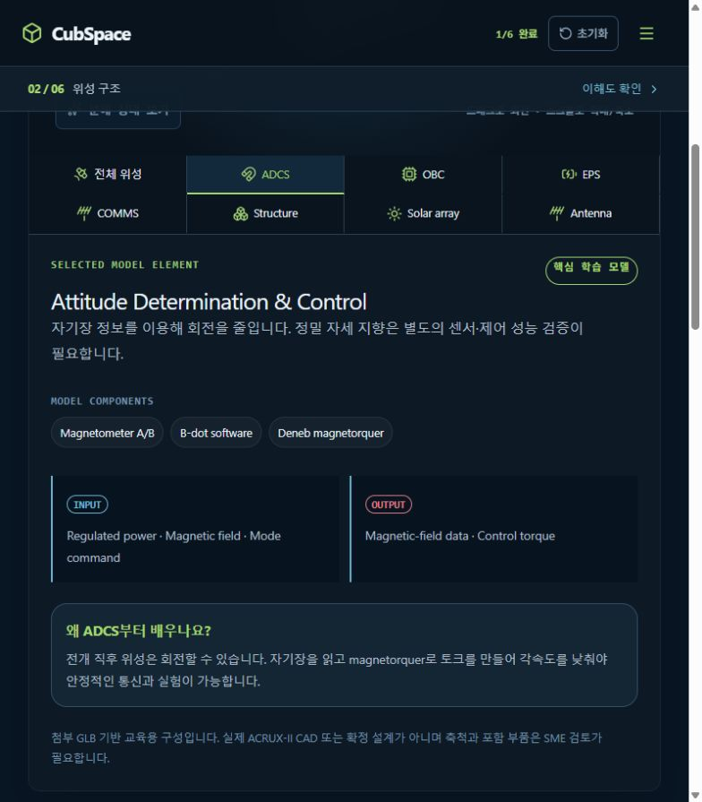

# [ComponentCard] 부품별 역할 카드와 Input/Output 의미 명확화

## A. Task Details
- **No.** CUB-005 | **Epic** ComponentCard | **Assignee** TBD (Draft)
- **Sign-off?** Red (todo)
- **Description:** 부품별 역할 카드와 Input/Output 의미 명확화
- **Target:** cubspace-branch/onboarding_training · **URL:** http://localhost:3000/#anatomy

## B. Relation
Hierarchy (제안): cubspace → onboarding → component_io → Cell → CUB-005
```prolog
% 제안 경로 / 승인된 Tree 원본·버전 TBD
mission_path('CUB-005', [cubspace, onboarding, component_io]).
task_cell('CUB-005', 'component_io_cell').
cell_leaf('component_io_cell', component_io).
sign_off('CUB-005', red).
```

## C. Problem Identification
- **Problem:** 부품은 클릭 가능한 정보 카드가 아니며 INPUT/OUTPUT은 ADCS 전체 값만 나열해 개별 경계가 모호하다.
- **Guideline:** UI 개선과 교육 정보 제공에 한정하며 미확정 사양을 채워 넣지 않는다. 04와 연계.
- **Reproduce Workflow:** ADCS 선택 → B-dot software 확인 → 역할·입출력·다음 연결 정보 부재 확인



## D. Desire Outcome
- **AC-1:** 부품 클릭 시 역할 / 받는 것 / 하는 일 / 내보내는 것 / 다음 연결 / 문제 시 영향 카드를 연다.
- **AC-2:** B-dot은 연속 자기장·timestamp·운용 모드 입력, 변화율 계산, 자기쌍극자 또는 구동 명령 출력을 설명한다.
- **AC-3:** 각 I/O의 제공자·수신자·종류·필요 단위와 시스템/부품 경계를 구분하고 닫기·키보드 조작을 지원한다.

## E. Action Note for AI
- 기준 확인·수정·검증 후 후보/URL/결과 제공 → Yellow에서 Human Inspection 대기. 지정 승인자의 실제 Sign-off 후 Green → 승인된 Update & Publish·운영 확인 후 Done. 범위 밖 변경 금지. 상세: INDEX.md.
