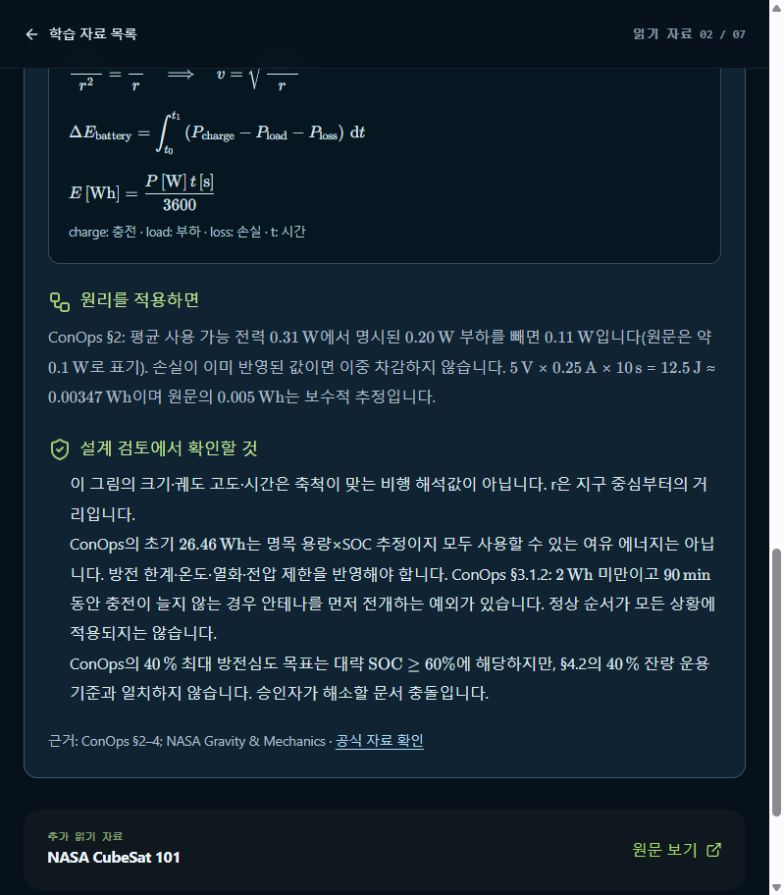

# [EnergyReview] SOC·DoD 운용 기준 충돌의 검토 기록 작성

## A. Task Details
- **No.** CUB-008 | **Epic** EnergyReview | **Assignee** TBD (Draft)
- **Sign-off?** Red (todo)
- **Description:** SOC·DoD 운용 기준 충돌의 검토 기록 작성
- **Target:** cubspace-branch/onboarding_training · **URL:** http://localhost:3000/learn/02

## B. Relation
Hierarchy (제안): cubspace → onboarding → energy_baseline → Cell → CUB-008
```prolog
% 제안 경로 / 승인된 Tree 원본·버전 TBD
mission_path('CUB-008', [cubspace, onboarding, energy_baseline]).
task_cell('CUB-008', 'energy_baseline_cell').
cell_leaf('energy_baseline_cell', energy_baseline).
sign_off('CUB-008', red).
```

## C. Problem Identification
- **Problem:** 앱에 40% 최대 DoD와 40% 잔량 운용 기준의 충돌이 명시돼 있으나 이를 해소할 승인 기준선은 확인되지 않는다.
- **Guideline:** 소프트웨어 오동작이 아닌 SME 검토 티켓이다. 임계값을 임의 통일하지 않는다.
- **Reproduce Workflow:** 읽기 자료 02 진입 → 에너지 검토 설명 확인 → 충돌과 적용 기준 확인



## D. Desire Outcome
- **AC-1:** 원문 버전·절·운용 모드별 SOC/DoD 의미를 비교표로 기록한다.
- **AC-2:** 정상·저전력 예외와 0.11 W/약 0.1 W, 0.00347/0.005 Wh의 계산·추정 차이를 구분한다.
- **AC-3:** SME 결정 또는 미해결 상태·담당자·확인 계획을 연결하고 승인된 내용만 자료에 반영한다.

## E. Action Note for AI
- 기준 확인·수정·검증 후 후보/URL/결과 제공 → Yellow에서 Human Inspection 대기. 지정 승인자의 실제 Sign-off 후 Green → 승인된 Update & Publish·운영 확인 후 Done. 범위 밖 변경 금지. 상세: INDEX.md.
