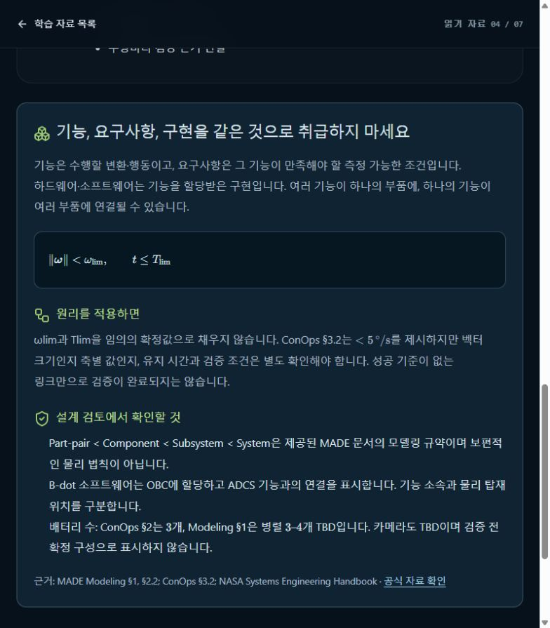

# [Configuration] 배터리 3셀 대 3–4셀 형상 충돌 추적

## A. Task Details
- **No.** CUB-009 | **Epic** Configuration | **Assignee** TBD (Draft)
- **Sign-off?** Red (todo)
- **Description:** 배터리 3셀 대 3–4셀 형상 충돌 추적
- **Target:** cubspace-branch/onboarding_training · **URL:** http://localhost:3000/learn/04

## B. Relation
Hierarchy (제안): cubspace → onboarding → battery_configuration → Cell → CUB-009
```prolog
% 제안 경로 / 승인된 Tree 원본·버전 TBD
mission_path('CUB-009', [cubspace, onboarding, battery_configuration]).
task_cell('CUB-009', 'battery_configuration_cell').
cell_leaf('battery_configuration_cell', battery_configuration).
sign_off('CUB-009', red).
```

## C. Problem Identification
- **Problem:** ConOps 3셀과 Modeling 병렬 3–4셀 TBD가 함께 남아 있어 교육 자료에서 사용할 형상 기준이 미확정이다.
- **Guideline:** 현재 Conflicting 표시는 유지한다. 비행 설계 선택은 Owner/SME가 결정한다.
- **Reproduce Workflow:** 읽기 자료 04 진입 → 설계 검토 확인 → 두 배터리 구성의 출처 확인



## D. Desire Outcome
- **AC-1:** 두 원문 버전·절과 선택 근거/시험 자료의 확보 상태를 기록한다.
- **AC-2:** 정격 용량·전력 설명에 미치는 영향과 변경 대상 목록을 작성한다.
- **AC-3:** 승인된 형상 또는 명시적 TBD를 설명·퀴즈·모델 표기에 일관되게 적용한다.

## E. Action Note for AI
- 기준 확인·수정·검증 후 후보/URL/결과 제공 → Yellow에서 Human Inspection 대기. 지정 승인자의 실제 Sign-off 후 Green → 승인된 Update & Publish·운영 확인 후 Done. 범위 밖 변경 금지. 상세: INDEX.md.
