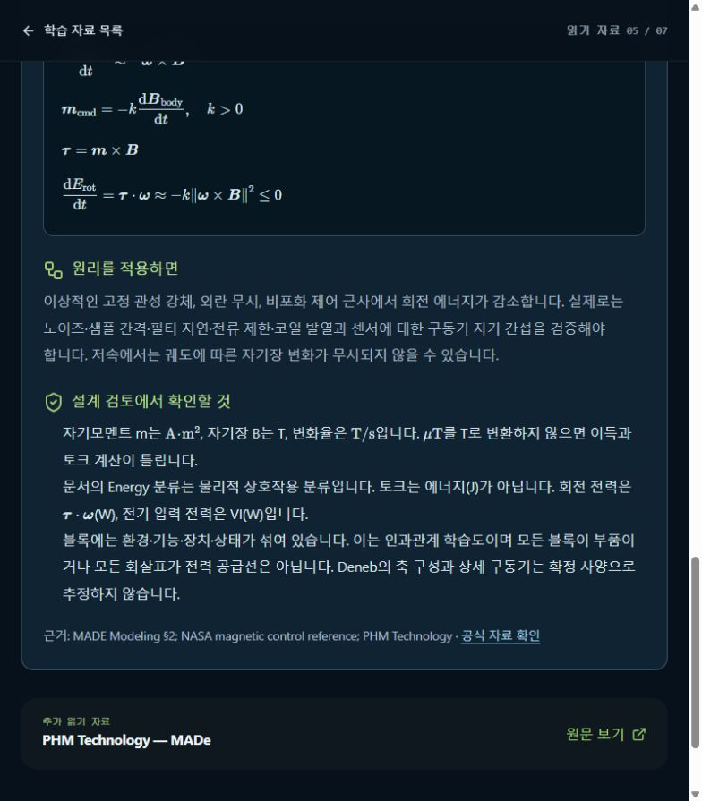

# [ModelEvidence] Deneb·카메라·GLB의 형상 근거와 한계 정리

## A. Task Details
- **No.** CUB-011 | **Epic** ModelEvidence | **Assignee** TBD (Draft)
- **Sign-off?** Red (todo)
- **Description:** Deneb·카메라·GLB의 형상 근거와 한계 정리
- **Target:** cubspace-branch/onboarding_training · **URL:** http://localhost:3000/learn/05

## B. Relation
Hierarchy (제안): cubspace → onboarding → hardware_evidence → Cell → CUB-011
```prolog
% 제안 경로 / 승인된 Tree 원본·버전 TBD
mission_path('CUB-011', [cubspace, onboarding, hardware_evidence]).
task_cell('CUB-011', 'hardware_evidence_cell').
cell_leaf('hardware_evidence_cell', hardware_evidence).
sign_off('CUB-011', red).
```

## C. Problem Identification
- **Problem:** Deneb 축·구동기 사양, 카메라 포함, GLB 날개 형상이 확정 하드웨어 근거와 연결되지 않은 상태다.
- **Guideline:** 교육용 모델 개선과 비행 형상 승인을 구분하며 검토 전 확정 사양을 만들지 않는다.
- **Reproduce Workflow:** 읽기 자료 05 진입 → Deneb 한계 확인 → 자료 03/04의 GLB·카메라 TBD와 비교



## D. Desire Outcome
- **AC-1:** 시각 자산·원문 주장·데이터시트·확정 CAD의 근거 수준을 항목별로 구분한다.
- **AC-2:** 1.083 Wh의 3축 일반화, 센서 관측 한계와 외란 토크 설명의 검증 필요 사항을 연결한다.
- **AC-3:** 확보 여부·담당자·후속 검토를 남기고 승인 전까지 모든 관련 화면에서 교육용/TBD 표기를 유지한다.

## E. Action Note for AI
- 기준 확인·수정·검증 후 후보/URL/결과 제공 → Yellow에서 Human Inspection 대기. 지정 승인자의 실제 Sign-off 후 Green → 승인된 Update & Publish·운영 확인 후 Done. 범위 밖 변경 금지. 상세: INDEX.md.
